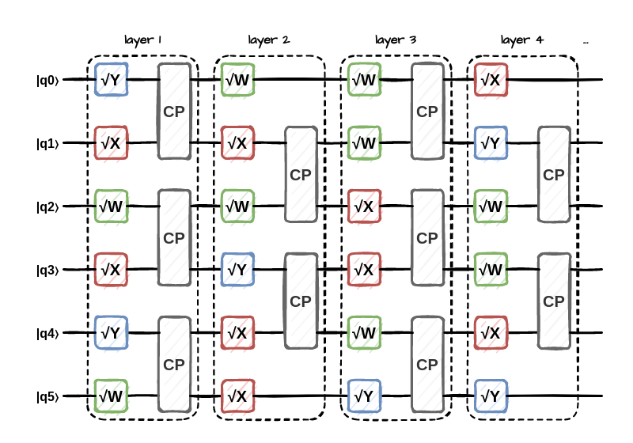

```{r setup, include = FALSE}
library(patchwork)
library(tidyverse)
```

## Introduction

As we are entering the era when quantum computing are becoming viable, it is especially important to focus on classical simulations of quantum systems. They can provide a useful insight into mechanisms behind quantum phenomena, and be used to verify the results of the new technology. In addition, current quantum devices are often call *Noisy Intermediate-Scale Quantum (NISQ)*, due to high amounts of noise that affects them. As a result, it may still be possible to keep classical simulations competitive, and incentivise the development of both paradigms. 

In general, simulating quantum circuits is an exponentially hard task -- both in terms of runtime and memory. This is because a quantum state of $n$ qubits is equivalent to some superposition of all possible $n$-bit strings, each weighted by a complex amplitude (whose modulus squared is equal to the probability of measuring the corresponding string). Therefore, there are $2^n$ complex numbers describing the state. However, many states can be *separated* into products of smaller states. If a state is separable into single-qubit states, it is *non-entangled*. Otherwise, there is some degree of *quantum entanglement* present -- which describes correlations in the measurements of individual qubits for the given system. This is what differentiates quantum computing from its classical counterpart, since classicaly, those measurements would be independent. There are methods for compressing states with less entanglement, which will be described below. Notwithstanding that, it is quantum simulations are obviously very energy inefficient. 

Two different circuits were selected for benchmarking -- *Quantum Fourier Transform (QFT)* and *Random Quantum Circuit (RAND)*. Likewise, two platforms were used two create and run the simulations, each representing a distinct approach. *Quantum Exact Simulation Toolkit (QuEST)* was used for full state vector simulations, while *iTensor* was leveraged to perform circuit simulations by contracting tensor networks of *matrix product states (MPS)* and *matrix product operators (MPO)*. 

Each approach allows different modifications to save the energy. QuEST requires multiprocessing for larger simulations due to memory limitations, which makes it very heavy on inter-node communication. Therefore, it was found to be beneficial to slightly reduce CPU clock frequency, so that most of the CPU time is not wasted waiting for the messages to arrive. On the other hand, iTensor is currently completely serial and single-threaded, but features a representation that makes compression easy for states with limited entanglement. Hence, it was found to be better for some algorithms and input states, despite its limitations. 


## Methodology

Below presented are circuits and frameworks used in this work. 

### Quantum Fourier Transform


*QFT* is a very common component of other quantum algorithms. It does a quantum analog to Discrete Fourier Transform on the input state, described by the following formula:
$$
QFT_N \lvert x \rangle = 
\frac{1}{\sqrt{N}}\sum_{y=0}^{N-1} \omega_N^{xy} \lvert y \rangle
$$

Where $N=2^n$ is the number of basis states, and $\omega_N=e^{\frac{2\pi i}{N}}$. This can be re-expressed as a tensor product of single-qubit states: 
$$
QFT_N \lvert x \rangle = 
\frac{1}{\sqrt{N}}\bigotimes_{k=1}^n 
\left( \lvert 0 \rangle + \exp{\frac{2\pi ix}{2^k} \lvert 1 \rangle} \right)
$$

Therefore, if the input state is the basis state $\lvert x \rangle$, its Quantum Fourier Transform won't introduce any new entanglement. However, if the input is in a superposition of basis states $\lvert \psi \rangle = \sum_{x=0}^{N-1} \psi_x \lvert x \rangle$, the corresponding transform will be a superposition of transforms of each basis state. This way, some amplitudes may cancel each other out, and alter the entanglement of the result. 

As a result, we say that QFT is *weakly entangling*, which means its output can have a different level of entanglement than input, but it is unlikely to arbitrarily create a very entangled state. 

### Random Circuit



### QuEST

### Underclocking

### SLURM


## Results

```{r load_quest_results, include = FALSE}
quest_energy <- read_delim("quest-energy.csv", delim = ',')
quest_energy <- select(
  quest_energy, 
  Ntasks = SLURM_NTASKS, 
  Frequency = SLURM_CPU_FREQ_REQ, 
  Circuit = PROG, 
  Nqubits = QREG_SIZE, 
  Runtime = RUNTIME, 
  Energy = ENERGY, 
  Slowdown = SLOWDOWN, 
  Savings = SAVINGS
)

cpu_freq_levels <- c("High", "Highm1", "Medium", "Low")

quest_energy <- mutate(
  quest_energy, 
  Frequency = factor(Frequency, levels = cpu_freq_levels), 
  Circuit = as.factor(str_to_upper(Circuit))
)

quest_energy <- group_by(quest_energy, Ntasks)
```

```{r load_itensor_results, include = FALSE}
itensor_energy <- read_delim("itensor-energy.csv", delim = ',')
itensor_energy <- select(
  itensor_energy, 
  Circuit = PROG, 
  Nqubits = QREG_SIZE, 
  InitState = INIT,
  MaxDim = MAX_DIM, 
  Runtime = RUNTIME, 
  Energy = ENERGY
)

itensor_energy <- mutate(
  itensor_energy, 
  Circuit = as.factor(str_to_upper(Circuit)), 
  Experiment = paste(Circuit, InitState, MaxDim)
)

experiments <- c(
  `BENCH |0..0> 16777216` = "RAND (full)", 
  `BENCH |0..0> 256`      = "RAND (trimmed)", 
  `QFT |Wn> 16777216`     = "QFT (W input)", 
  `QFT |0..0> 16777216`   = "QFT (0 input)"
)

itensor_energy <- mutate(itensor_energy, Experiment = experiments[Experiment])
itensor_energy <- filter(itensor_energy, !is.na(Experiment))
itensor_energy <- mutate(
  itensor_energy, 
  Experiment = factor(Experiment, levels = experiments)
)

itensor_energy <- itensor_energy[-17, ]
itensor_energy <- group_by(itensor_energy, Experiment)
```

The results were written by a SLURM script to an output file in a CSV format with three columns -- *Nqubits*, *Ntasks* and *Time* (in *ms*). In order to save on credits, most jobs were submitted for a fixed number of nodes, as otherwise some of the reserved resources would stay idle. The outputs of each series of computations were combined by hand[^5]. 

The final raw data transformed into more readable form are presented below. $N=2^k$ columns represent the number of nodes, while floating point values represent timings in seconds. Some timings are not available due to memory limits, and these are noted as *NA*. 

*QuEST* timings: 
```{r print_quest_timings, echo = FALSE}
# Print QuEST timings in a readable format
quest_energy %>% 
  select(-Energy, -Slowdown, -Savings) |>
  pivot_wider(names_from = Ntasks, names_prefix = "N=", values_from = Runtime)
```

*iTensor* timings:
```{r print_itensor_timings, echo = FALSE}
# Print QuEST timings in a readable format
itensor_energy
```

Desired plots: 


```{r plot-weak-scaling, echo = FALSE}
plt_weak_scaling <- quest_energy |> 
  group_by(Circuit, Frequency, Baseline = Nqubits - log2(Ntasks)) |> 
  mutate(Baseline = as.factor(Baseline), Energy = Energy / 1E6, 
         Efficiency = first(Runtime) / Runtime) |> 
  filter(Baseline == 32, Frequency != "Highm1") |> 
  rename(`CPU frequency` = Frequency)

plt_base <- ggplot(plt_weak_scaling) + 
  scale_x_continuous(breaks = 2^(0:4)) + 
  scale_linetype_manual(values = c("longdash", "dashed", "dotted")) +
  scale_color_brewer(palette = "Set1") + 
  xlab("Nodes used") + 
  guides(colour = guide_legend(order = 1), 
         shape = guide_legend(order = 2), 
         linetype = guide_legend(order = 2, keywidth = unit(1, "cm")))

p1 <- plt_base + 
  geom_point(aes(x = Ntasks, y = Efficiency, colour = Circuit, 
                 shape = `CPU frequency`)) + 
  geom_line(aes(x = Ntasks, y = Efficiency, colour = Circuit, 
                linetype = `CPU frequency`)) + 
  ylab("Parallel efficiency")

p2 <- plt_base + 
  geom_point(aes(x = Ntasks, y = Energy, colour = Circuit, 
                 shape = `CPU frequency`)) + 
  geom_line(aes(x = Ntasks, y = Energy, colour = Circuit, 
                linetype = `CPU frequency`)) + 
  ylab("Energy consumption [MJ]")
  

p1 + p2 + plot_layout(guides = 'collect') & 
  theme(legend.position = 'top', legend.direction = "horizontal")

ggsave("out/weak-scaling.pdf", width = 8, height = 5, units = "in")
ggsave("out/weak-scaling.png", width = 8, height = 5, units = "in")
```


```{r plot-power-scaling, echo = FALSE}
plt_power_scaling <- quest_energy |> 
  group_by(Circuit, Frequency, Baseline = Nqubits - log2(Ntasks)) |> 
  mutate(Baseline = as.factor(Baseline), 
         Power = Energy / 1E3 / Runtime / Ntasks) |> 
  filter(Baseline == 32, Frequency != "Highm1") |> 
  rename(`CPU frequency` = Frequency)

ggplot(plt_power_scaling) + 
  geom_point(aes(x = Ntasks, y = Power, colour = Circuit, 
                 shape = `CPU frequency`)) + 
  geom_line(aes(x = Ntasks, y = Power, colour = Circuit, 
                linetype = `CPU frequency`)) + 
  scale_x_continuous(breaks = 2^(0:4)) + 
  scale_linetype_manual(values = c("longdash", "dashed", "dotted"), 
                        guide = guide_legend(keywidth = unit(1, "cm"))) +
  scale_color_brewer(palette = "Set1") + 
  xlab("Nodes used") + 
  ylab("Average power per node [kW]") + 
  theme(legend.position = "right", legend.direction = "vertical")
```


```{r plot-runtime-energy, echo = FALSE}
plt_energy_runtime <- quest_energy |> 
  group_by(Circuit, Frequency, Baseline = Nqubits - log2(Ntasks)) |> 
  mutate(Baseline = as.factor(Baseline), Energy = Energy / 1E6) |> 
  filter(Baseline == 32, Frequency != "High") |> 
  rename(`CPU frequency` = Frequency)

plt_base <- ggplot(plt_energy_runtime) + 
  scale_x_continuous(breaks = 2^(0:4)) + 
  scale_linetype_manual(values = c("longdash", "dashed", "dotted")) +
  scale_color_brewer(palette = "Set1") + 
  xlab("Nodes used") +
  ylim(c(0, 30)) + 
  guides(colour = guide_legend(order = 1), 
         shape = guide_legend(order = 2), 
         linetype = guide_legend(order = 2, keywidth = unit(1, "cm")))

p1 <- plt_base + 
  geom_point(aes(x = Ntasks, y = 100 * Slowdown, colour = Circuit, 
                 shape = `CPU frequency`)) + 
  geom_line(aes(x = Ntasks, y = 100 * Slowdown, colour = Circuit, 
                linetype = `CPU frequency`)) + 
  ylab("Runtime increase [%]")

p2 <- plt_base + 
  geom_point(aes(x = Ntasks, y = -100 * Savings, colour = Circuit, 
                 shape = `CPU frequency`)) + 
  geom_line(aes(x = Ntasks, y = -100 * Savings, colour = Circuit, 
                linetype = `CPU frequency`)) + 
  ylab("Energy decrease [%]")

p1 + p2 + plot_layout(guides = 'collect') & 
  theme(legend.position = 'top', legend.direction = "horizontal")

ggsave("out/runtime-vs-energy.pdf", width = 8, height = 5, units = "in")
ggsave("out/runtime-vs-energy.png", width = 8, height = 5, units = "in")
```

```{r plot-itensor-runtimes, echo = FALSE, message = FALSE}
plt_energy_itensor <- itensor_energy |> 
  group_by(Experiment) |> 
  mutate(Runtime = Runtime)

ggplot(plt_energy_itensor) + 
  geom_smooth(aes(x = Nqubits, y = Runtime, colour = Experiment), 
              fill = "gray97", level = 0, linewidth = .5) + 
  geom_point(aes(x = Nqubits, y = Runtime, colour = Experiment, 
                 shape = Experiment), size = 1.6) + 
  xlab("Number of qubits") + 
  ylab("Runtime [s]") + 
  labs(colour = "Circuit", shape = "Circuit") + 
  scale_x_continuous(breaks = 1:9 * 10) + 
  scale_y_continuous(breaks = 0:13 * 120) + 
  scale_color_brewer(palette = "Set1") + 
  scale_shape_manual(values = c(1, 2, 0, 5))

ggsave("out/itensor-runtimes.pdf", width = 9, height = 5, units = "in")
ggsave("out/itensor-runtimes.png", width = 9, height = 5, units = "in")
```

